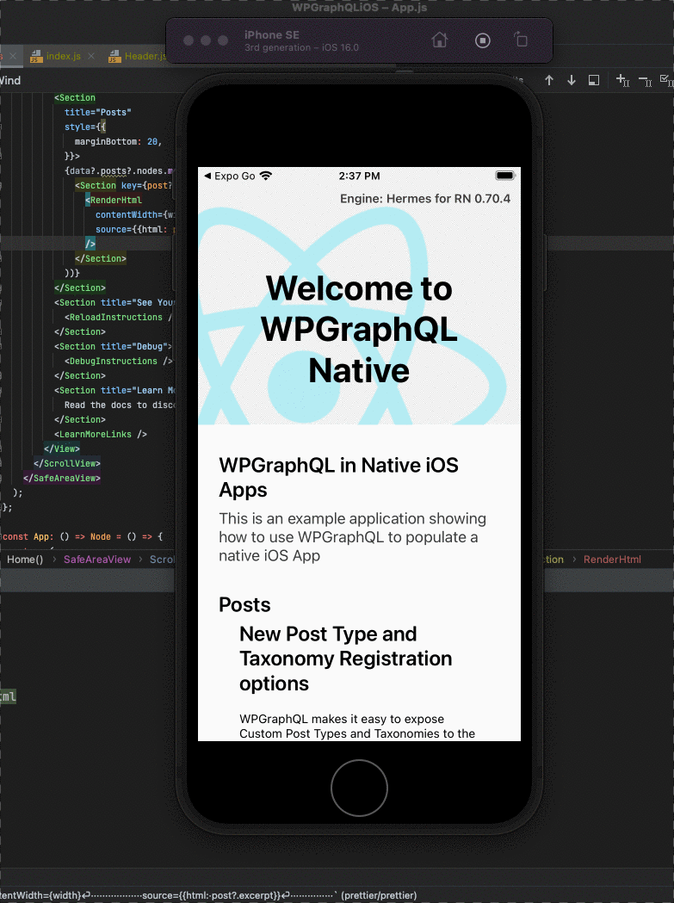

# WPGraphQL React Native Example

This is an example showing how to use WPGraphQL to populate data in a React Native App. 

## Demo

Below is an animated GIF showing the app in action, using the same content that populates the WPGraphQL.com blog.

## Run the App

- Clone the repo
- From within the cloned directory: 
  - `npm install`
  - `npm run ios`
